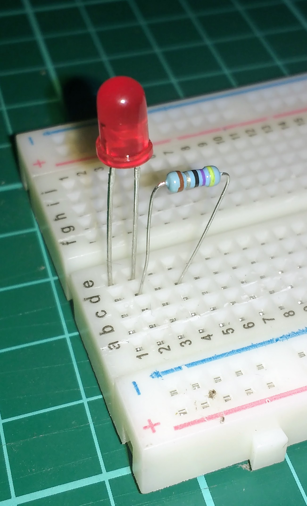
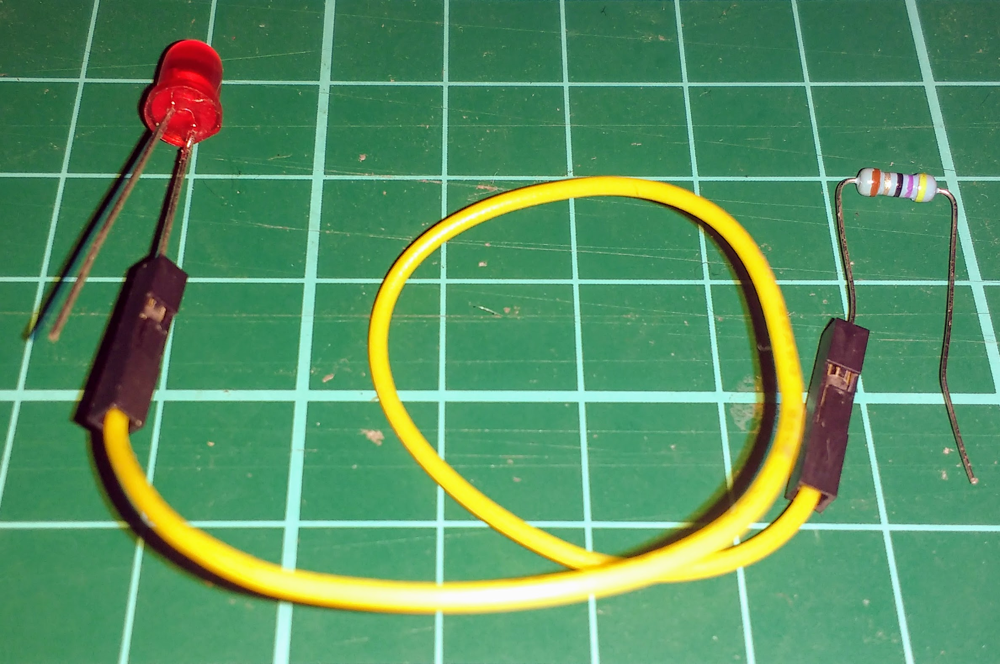
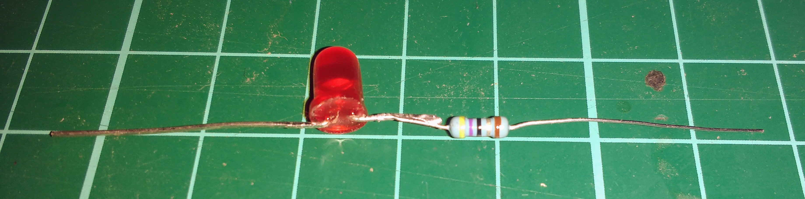
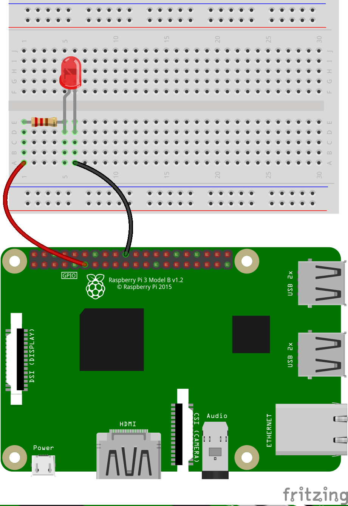
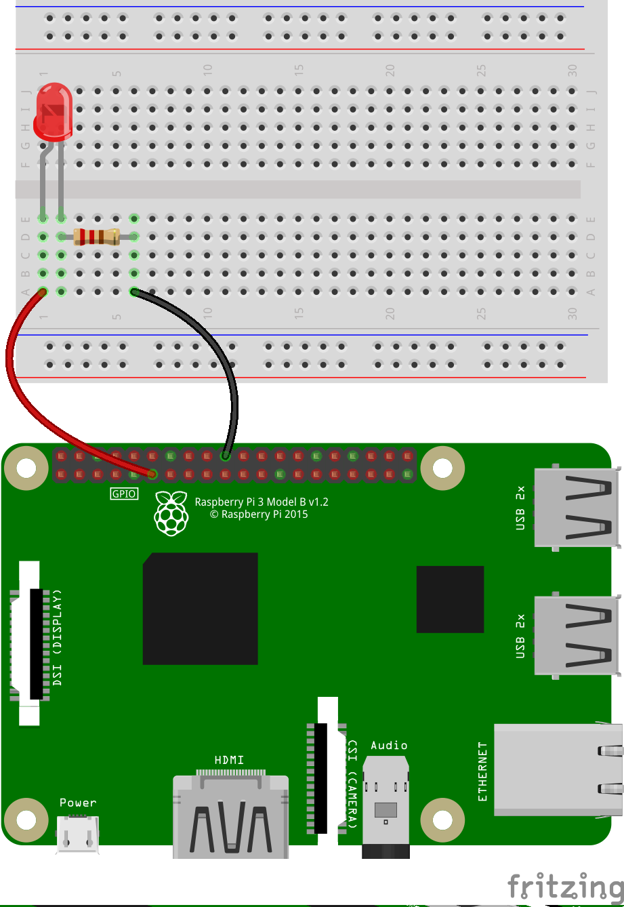
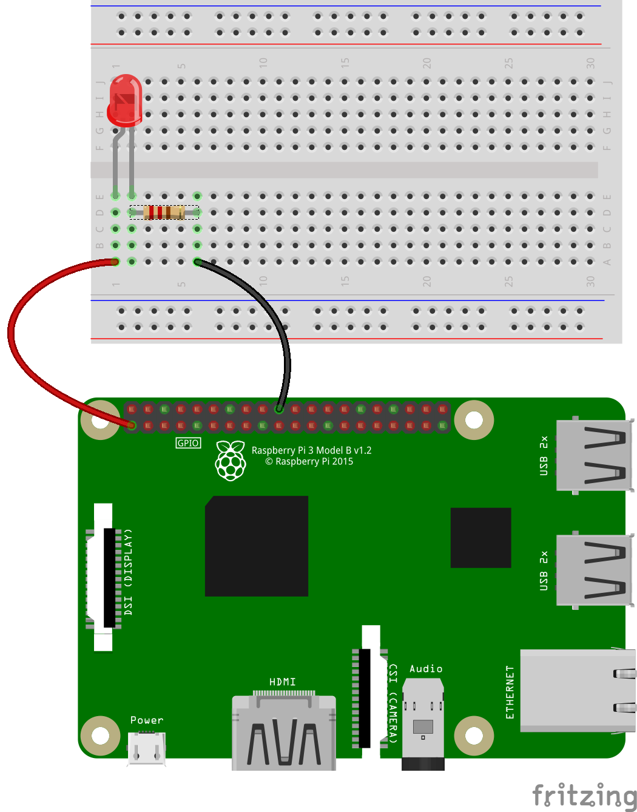

The Raspberry Pi computer has a number of **General-Purpose Input/Output** pins, or GPIO pins for short. These can be used to interact with electronic components. You can learn more about them by looking at [this resource](../../rpi-gpio-pins){:target="_blank"}.

LED stands for **l**ight-**e**mitting **d**iode. It is an electronic component that emits light when current flows through it. The **diode** part of the name tells us that it will only conduct electricity in one direction, so you need to be careful how you connect it to your circuits.

You need to use a resistor when wiring an LED to a Raspberry Pi to make sure the LED doesn't blow. Learn how to work out what kind of resistor to use with your LED by looking at [this resource](../../generic-physical-led-calcs){:target="_blank"}.

- To connect an LED to a resistor, place the LED and resistor in series with each other. You can use a breadboard, jumper leads, or solder to connect them. It doesn't matter which leg of the LED the resistor is connected to.

	
	
	

- Once the LED and resistor are in series with each other, you can use jumper leads to connect the circuit to the Raspberry Pi. The long leg of the LED should connect to a numbered GPIO pin and the short leg to a ground pin (labelled **GND**), as shown in the two diagrams below.

	
	

- If you want to test whether your LED is working correctly, you can connect it directly to the 3.3V pin on the Raspberry Pi.

	

